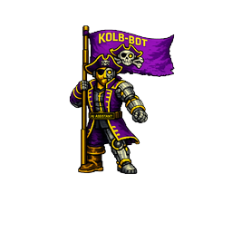

<p align="center">
  
</p>

# Kolb-Bot

Kolb-Bot is a private, self-hosted AI workspace — a fully branded derivative
of Open WebUI, deployed as its own Docker Compose stack and served at
`https://kolb-bot.com`.

- **Product**: Kolb-Bot (`kolb-bot`)
- **Terminal**: Kolb Terminal — on by default, per-user isolated
- **Computer workspace**: Kolb Computer — CPTR gateway, auto-connects when configured, admin-only by default
- **Default host port**: `3101` (behind the reverse proxy)

The original build specification lives in `docs/BUILD_SPEC.md`. Upstream
provenance and licenses: `docs/UPSTREAM.md`, `docs/LICENSE_NOTES.md`.

## Quick start

```bash
cp .env.example .env
openssl rand -hex 32          # -> WEBUI_SECRET_KEY in .env
docker compose up -d --build
# app: http://127.0.0.1:3101 — first account created becomes admin
```

Public signup is disabled by default; add users from the admin panel.
Full deployment (reverse proxy, HTTPS, upgrades, rollback):
`docs/DEPLOYMENT.md`.

## Development

```bash
npm ci
npm run dev            # frontend dev server
npm run test:frontend  # unit tests (includes brand tests)
npm run build          # production frontend
bash scripts/audit-branding.sh   # branding enforcement (run post-build)
```

Backend: `backend/` (FastAPI; see `backend/start.sh` and the Dockerfile for
the production entrypoint).

## Repository guide

| Path | Purpose |
| --- | --- |
| `src/lib/brand.ts`, `backend/open_webui/brand.py` | Brand configuration (single source of truth) |
| `branding/original/` | Owner-supplied logo assets (authoritative, never modified) |
| `scripts/` | Brand apply/asset generation, branding audit, health checks |
| `services/kolb-terminal/` | Kolb Terminal image build (from Open Terminal source) |
| `docker-compose.yml`, `.env.example`, `deploy/` | Deployment stack |
| `docs/` | Architecture, deployment, security, backup, branding, upstream sync, licensing |

## Documentation

- `docs/ARCHITECTURE.md` — components and data flow
- `docs/DEPLOYMENT.md` — install, upgrade, rollback
- `docs/SECURITY.md` — security posture and isolation
- `docs/BACKUP_RESTORE.md` — tested backup/restore procedure
- `docs/OPEN_TERMINAL.md` — Kolb Terminal service
- `docs/CPTR_INTEGRATION.md` — Kolb Computer (CPTR gateway)
- `docs/BRANDING.md` / `docs/BRANDING_AUDIT.md` — brand system and enforcement
- `docs/UPSTREAM.md` / `docs/UPSTREAM_SYNC.md` — provenance and sync process
- `docs/LICENSE_NOTES.md` — licensing boundaries (read before scaling usage)

## License

Derived from Open WebUI; all upstream license files are preserved at the
repository root. This build relies on the upstream license's small-deployment
exception (≤ 50 users / rolling 30 days) for its branding — see
`docs/LICENSE_NOTES.md`.
